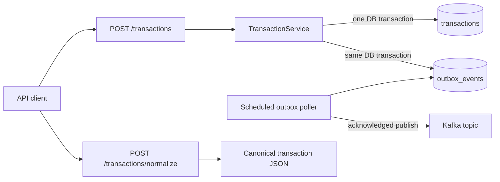

# Transaction Outbox Service

A small Spring Boot payment service that stores canonical transactions in
PostgreSQL, publishes `TRANSACTION_CREATED` events to Kafka through a
transactional outbox, and normalizes a legacy bank JSON format.

## Architecture



The database is the consistency boundary. The request never dual-writes to
PostgreSQL and Kafka. Delivery is at least once, so consumers should deduplicate
on `eventId`. Published outbox rows are retained for audit; an archival policy is
called out as a production follow-up in [the architecture notes](docs/architecture.md).

## Stack

- Java 21 and Spring Boot 4.1
- PostgreSQL 17 with Flyway migrations
- Apache Kafka 4.1 in single-node KRaft mode for local development
- Maven Wrapper, JUnit 6, Mockito, and AssertJ

## Run locally

Prerequisites: Java 21+ and Docker with Compose.

```bash
docker compose up -d
docker compose exec kafka /opt/kafka/bin/kafka-topics.sh \
  --bootstrap-server localhost:9092 \
  --create --if-not-exists \
  --topic payments.transactions.created \
  --partitions 3 \
  --replication-factor 1
./mvnw spring-boot:run
```

The service starts at `http://localhost:8080`. Flyway creates both tables on
startup. Check readiness with:

```bash
curl http://localhost:8080/actuator/health
```

Stop the dependencies with `docker compose down`. Add `-v` only when you also
want to remove the local PostgreSQL volume.

## API

### Create a transaction

Amounts are integer minor units: `150000` means INR 1,500.00.

```bash
curl -i -X POST http://localhost:8080/api/v1/transactions \
  -H 'Content-Type: application/json' \
  --data @examples/create-transaction.json
```

The endpoint returns `201 Created`, the canonical transaction, and a `Location`
header. `transactionId`, `status`, and `createdAt` may be omitted; they default to
a new UUID, `PENDING`, and the current UTC time. `externalReference` is unique,
so a duplicate returns `409 Conflict`.

Fetch the stored record:

```bash
curl http://localhost:8080/api/v1/transactions/{transactionId}
```

### Normalize a legacy record

```bash
curl -sS -X POST http://localhost:8080/api/v1/transactions/normalize \
  -H 'Content-Type: application/json' \
  --data @examples/legacy-transaction.json
```

Relevant transformations:

| Legacy value | Canonical value |
|---|---|
| `"txn_amount": "1500.00"` | `"amount": 150000` |
| `"txn_type": "DR"` | `"type": "DEBIT"` |
| `payer.acct_no` | `sourceAccount` |
| `payee.acct_no` | `destinationAccount` |
| `08-08-2026 14:32:11` in Asia/Kolkata | `2026-08-08T09:02:11Z` |
| IFSC codes and remarks | `metadata` |

Normalization has no side effects. Its response can be submitted directly to
the create endpoint.

### Inspect Kafka and PostgreSQL

Consume created events:

```bash
docker compose exec kafka /opt/kafka/bin/kafka-console-consumer.sh \
  --bootstrap-server localhost:9092 \
  --topic payments.transactions.created \
  --from-beginning
```

Inspect outbox state:

```bash
docker compose exec postgres psql -U payments -d payments -c \
  "SELECT id, aggregate_id, status, retry_count, published_at FROM outbox_events ORDER BY created_at;"
```

## Build and test

```bash
./mvnw clean verify
```

The unit suite covers exact amount/date/type normalization, atomic-write service
logic, duplicate detection, outbox state transitions, Kafka acknowledgement, and
retry scheduling. CI runs the same command on every pull request and push to
`main`.

## Configuration

| Environment variable | Default |
|---|---|
| `DB_URL` | `jdbc:postgresql://localhost:5432/payments` |
| `DB_USERNAME` / `DB_PASSWORD` | `payments` / `payments` |
| `KAFKA_BOOTSTRAP_SERVERS` | `localhost:9092` |
| `PAYMENTS_KAFKA_TOPIC` | `payments.transactions.created` |
| `OUTBOX_POLL_DELAY` | `1s` |
| `OUTBOX_BATCH_SIZE` | `50` |
| `OUTBOX_MAX_RETRIES` | `8` |
| `OUTBOX_PUBLISH_TIMEOUT` | `10s` |

For retry, concurrency, audit-retention, and production-hardening details, see
[docs/architecture.md](docs/architecture.md).
