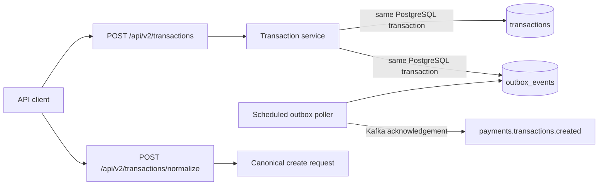

# Transaction Outbox Service

## What this is

This small Spring Boot service ingests canonical transaction records into
PostgreSQL, stages a transaction-created event in the same database transaction,
and publishes that event to Kafka through a transactional outbox. It also
normalizes a legacy bank-style JSON record into the canonical create request. It
is **not** payment authorization, money movement, settlement, ledgering, or
reconciliation.

## Architecture at a glance



The outbox prevents a database/Kafka dual write: a successful create commits the
transaction and a `PENDING` outbox row together. A later poller publishes the
stored event and marks that outbox row `PUBLISHED` only after Kafka acknowledges
it. Delivery is at least once, so consumers deduplicate `eventId`.

Two statuses are deliberately different:

- Transaction `PENDING` is the initial ingestion record status. It does **not**
  mean a payment workflow is running; this service implements none.
- Outbox `PUBLISHED` means Kafka acknowledged the transaction-created event. It
  does **not** mean the transaction/payment succeeded.

## Run locally

Prerequisites: Java 21+, Docker with Compose, GNU Make, and Python 3. Node.js
22+ and Chrome/Chromium are needed only for `make docs-lint`.

```bash
make run
curl http://localhost:8080/actuator/health
```

The service listens on `http://localhost:8080`; PostgreSQL and Kafka remain
inside the Compose network. To use another host port, run
`APP_PORT=18080 make run`.

```bash
make stop
# Equivalent lifecycle command: docker compose down (keeps local data volumes)

make reset
# Equivalent lifecycle command: docker compose down -v (removes local PostgreSQL and Kafka volumes)
```

`docker compose down` stops containers but preserves previous PostgreSQL and
Kafka data. `docker compose down -v` removes those named local volumes and is
the clean-start command.

## Try the APIs

Create a canonical transaction. Amounts are integer paise, so `150000` means
INR 1,500.00.

```bash
curl -i -X POST http://localhost:8080/api/v2/transactions \
  -H 'Content-Type: application/json' \
  --data @examples/create-transaction.json
```

Copy the returned `transactionId` to fetch it:

```bash
curl http://localhost:8080/api/v2/transactions/{transactionId}
```

Normalize a legacy record. This returns the canonical create-request JSON; it
does not save a transaction or publish an event.

```bash
curl -sS -X POST http://localhost:8080/api/v2/transactions/normalize \
  -H 'Content-Type: application/json' \
  --data @examples/legacy-transaction.json
```

The normalized response can be submitted unchanged to the create endpoint.

## Verify PostgreSQL, outbox, and Kafka

Compare the ingestion record with its event-delivery record:

```bash
docker compose exec postgres psql -U payments -d payments -c \
  "SELECT t.id AS transaction_id, t.external_reference, t.status AS transaction_status, o.status AS outbox_status, o.published_at FROM transactions t JOIN outbox_events o ON o.aggregate_id = t.id ORDER BY t.received_at DESC;"
```

Read Kafka keys and payloads:

```bash
docker compose exec kafka /opt/kafka/bin/kafka-console-consumer.sh \
  --bootstrap-server kafka:29092 \
  --topic payments.transactions.created \
  --from-beginning \
  --property print.key=true \
  --property key.separator=' | '
```

`--from-beginning` intentionally shows every retained record in the topic. Since
ordinary `docker compose down` preserves Kafka volumes, earlier simulator or
manual events can appear too. Use a unique `externalReference`, filter the
output, or run `make reset` before a clean local demonstration.

`GET /actuator/outbox` is a separate delivery snapshot; `/actuator/health`
answers only application health.

## Behavioral contract

- **Money:** V2 accepts positive integer INR paise only.
- **Idempotency:** `(sourceSystem, externalReference)` is the key. The first
  accepted request returns `201`; an identical replay returns the original
  transaction with `200`; a different body for the same key returns `409`.
- **Delivery:** The Kafka topic is `payments.transactions.created`. Kafka uses
  the transaction UUID as its key. Delivery is at least once, so consumers must
  deduplicate `eventId`.
- **Normalization:** `POST /api/v2/transactions/normalize` is deterministic and
  has no PostgreSQL or Kafka side effect.

## Verification

| Command | Purpose |
| --- | --- |
| `make unit-test` | Fast core-logic tests |
| `make integration-test` | PostgreSQL/Kafka Testcontainers tests |
| `make test` | Unit and integration tests with coverage enforcement |
| `make build` | Executable JAR and local image |
| `make lint` | Checkstyle and Python script compilation |
| `make docs-lint` | Markdown, links, traceability, and Mermaid rendering |
| `make traffic` | Mixed end-to-end API/DB/outbox/Kafka smoke scenario |
| `make load-test LOAD_REQUESTS=250 LOAD_CONCURRENCY=20` | Concurrent local diagnostic scenario |

CI runs the same static, test, build, smoke, and bounded-load gates. Dependency
review blocks moderate-or-higher newly introduced vulnerabilities when the
repository dependency graph is available; otherwise CI records an explicit
skip notice instead of reporting a false failure.

Load output is local diagnostic evidence only. It is not a production-capacity,
availability, latency-SLO, HA, or disaster-recovery claim.

## Further reading

- [Architecture and system boundaries](docs/architecture.md)
- [Ingestion contract rationale](docs/decisions/0001-v1-ingestion-contract.md)
- [API/event versioning rationale](docs/decisions/0002-api-event-versioning.md)
- [Forward-only Flyway rationale](docs/decisions/0003-forward-only-flyway-upgrades.md)
- [V3 identity migration procedure](docs/migrations/v3-identity-migration.md)
- [V7 event-quarantine procedure](docs/migrations/v7-event-quarantine.md)
- [Use-case traceability](docs/use-cases.md)
- [Complete Mermaid diagram catalog](docs/sequence-diagrams.md)

This synthetic exercise has no authentication, real-data handling policy, or
software license. Do not use real payment data in the local stack.
