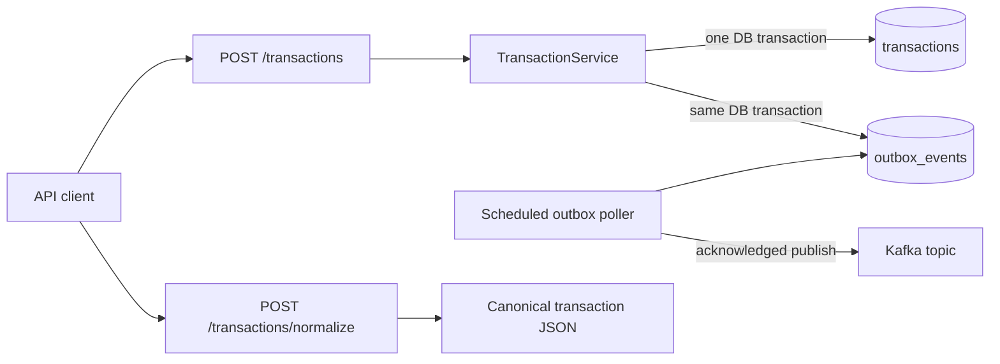

# Transaction Outbox Service

A small Spring Boot payment service that stores canonical transactions in
PostgreSQL, publishes `TRANSACTION_CREATED` events to Kafka through a
transactional outbox, and normalizes a legacy bank JSON format.

## Architecture



The database is the consistency boundary. The request never dual-writes to
PostgreSQL and Kafka. Delivery is at least once, so consumers should deduplicate
on `eventId`. Published outbox rows are retained for audit; an archival policy is
called out as a production follow-up in [the architecture notes](docs/architecture.md).

Detailed behavioral documentation:

- [Use-case model](docs/use-cases.md) — complete implemented and planned scope,
  with actors, triggers, outcomes, and explicit status.
- [Sequence-diagram catalog](docs/sequence-diagrams.md) — success, rejection,
  retry, concurrency, operations, testing, and next-phase interaction flows.

## Stack

- Java 21 and Spring Boot 4.1
- PostgreSQL 17 with Flyway migrations
- Apache Kafka 4.1 in single-node KRaft mode for local development
- Maven Wrapper, JUnit 6, Mockito, and AssertJ

## Run locally

Prerequisites: Java 21+, Docker with Compose, GNU Make, and Python 3.

```bash
make run
```

This one command builds the application image, starts PostgreSQL and Kafka,
creates the Kafka topic, starts the service, and waits for every health check.
The service is then available at `http://localhost:8080`. Flyway creates both
tables on startup. Check readiness with:

```bash
curl http://localhost:8080/actuator/health
```

Stop the stack with `make stop`. PostgreSQL data is retained between runs.

### Make targets

| Command | Purpose |
|---|---|
| `make build` | Build the executable JAR and local container image |
| `make run` | Build and start the complete healthy local stack |
| `make stop` | Stop the stack while retaining database data |
| `make unit-test` | Run the fast unit suite only |
| `make integration-test` | Run real PostgreSQL/Kafka Testcontainers tests only |
| `make test` | Run all unit and integration tests |
| `make coverage` | Run all tests and enforce at least 70% line coverage |
| `make lint` | Run Checkstyle and compile-check the traffic simulator |
| `make traffic` | Start the stack and run the mixed end-to-end smoke scenario |
| `make load-test` | Start the stack and run configurable concurrent traffic |
| `make check` | Run lint, all tests, coverage enforcement, and the build |

## API

### Create a transaction

Amounts are integer minor units: `150000` means INR 1,500.00.

```bash
curl -i -X POST http://localhost:8080/api/v1/transactions \
  -H 'Content-Type: application/json' \
  --data @examples/create-transaction.json
```

The endpoint returns `201 Created`, the canonical transaction, and a `Location`
header. `transactionId`, `status`, and `createdAt` may be omitted; they default to
a new UUID, `PENDING`, and the current UTC time. `externalReference` is unique,
so a duplicate returns `409 Conflict`.

Fetch the stored record:

```bash
curl http://localhost:8080/api/v1/transactions/{transactionId}
```

### Normalize a legacy record

```bash
curl -sS -X POST http://localhost:8080/api/v1/transactions/normalize \
  -H 'Content-Type: application/json' \
  --data @examples/legacy-transaction.json
```

Relevant transformations:

| Legacy value | Canonical value |
|---|---|
| `"txn_amount": "1500.00"` | `"amount": 150000` |
| `"txn_type": "DR"` | `"type": "DEBIT"` |
| `payer.acct_no` | `sourceAccount` |
| `payee.acct_no` | `destinationAccount` |
| `08-08-2026 14:32:11` in Asia/Kolkata | `2026-08-08T09:02:11Z` |
| IFSC codes and remarks | `metadata` |

Normalization has no side effects. Its response can be submitted directly to
the create endpoint.

### Inspect Kafka and PostgreSQL

Consume created events:

```bash
docker compose exec kafka /opt/kafka/bin/kafka-console-consumer.sh \
  --bootstrap-server kafka:29092 \
  --topic payments.transactions.created \
  --from-beginning
```

Inspect outbox state:

```bash
docker compose exec postgres psql -U payments -d payments -c \
  "SELECT id, aggregate_id, status, retry_count, published_at FROM outbox_events ORDER BY created_at;"
```

## Build and test

```bash
make test
```

The unit suite covers exact amount/date/type normalization, atomic-write service
logic, duplicate detection, outbox state transitions, Kafka acknowledgement, and
retry scheduling. The integration suite boots the real HTTP application against
ephemeral PostgreSQL and Kafka containers, then verifies persistence, duplicate
and validation failures, normalization, outbox publication, and the consumed
Kafka event. The JaCoCo HTML report is written to `target/site/jacoco/index.html`.

### End-to-end traffic and load

Run a deterministic mixed scenario:

```bash
make traffic
```

It sends successful creates and normalization requests together with deliberate
duplicate, validation, and normalization failures. It then queries PostgreSQL,
waits for every matching outbox row to become `PUBLISHED`, consumes Kafka from
the beginning, and fails unless every expected transaction event is present.

Run a larger concurrent scenario by overriding the defaults:

```bash
make load-test LOAD_REQUESTS=250 LOAD_CONCURRENCY=20
make stop
```

The load report includes the status distribution, throughput, and p50/p95/p99
HTTP latency. Each invocation uses a unique reference prefix, so retained local
data does not interfere with later runs.

## Continuous integration

The GitHub Actions workflow defines independent checks for:

- Java/Python lint and Docker Compose validation;
- unit tests;
- Testcontainers PostgreSQL/Kafka integration tests;
- JaCoCo coverage enforcement and uploaded test reports;
- executable JAR and container-image builds; and
- mixed end-to-end traffic plus a bounded concurrent load scenario.

The checks run for pull requests and pushes targeting `main`.

## Configuration

| Environment variable | Default |
|---|---|
| `DB_URL` | `jdbc:postgresql://localhost:5432/payments` |
| `DB_USERNAME` / `DB_PASSWORD` | `payments` / `payments` |
| `KAFKA_BOOTSTRAP_SERVERS` | `localhost:9092` |
| `PAYMENTS_KAFKA_TOPIC` | `payments.transactions.created` |
| `OUTBOX_POLL_DELAY` | `1s` |
| `OUTBOX_BATCH_SIZE` | `50` |
| `OUTBOX_MAX_RETRIES` | `8` |
| `OUTBOX_PUBLISH_TIMEOUT` | `10s` |

For retry, concurrency, audit-retention, and production-hardening details, see
[docs/architecture.md](docs/architecture.md).
