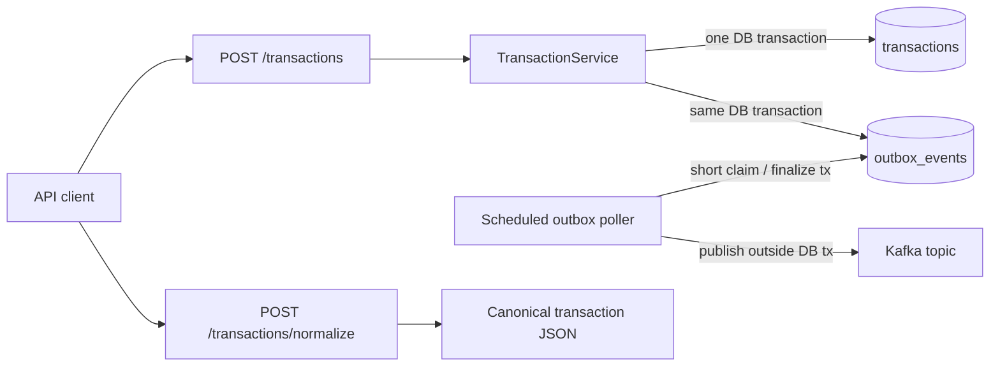

# Transaction Outbox Service

A small Spring Boot payment service that stores canonical transactions in
PostgreSQL, publishes `TRANSACTION_CREATED` events to Kafka through a
transactional outbox, and normalizes a legacy bank JSON format.

## Architecture



The database is the consistency boundary. The request never dual-writes to
PostgreSQL and Kafka. Delivery is at least once, so consumers should deduplicate
on `eventId`. Published rows are retained as mutable operational history; a real
audit archive is a production follow-up in
[the architecture notes](docs/architecture.md).

Detailed behavioral documentation:

- [V1 contract decision](docs/decisions/0001-v1-ingestion-contract.md) — exact
  money, identity, ownership, idempotency, metadata, migration, normalization,
  and outbox-recovery rules.
- [Use-case model](docs/use-cases.md) — complete implemented and planned scope,
  with actors, triggers, outcomes, and explicit status.
- [Sequence-diagram catalog](docs/sequence-diagrams.md) — success, rejection,
  retry, concurrency, operations, testing, and next-phase interaction flows.

## Stack

- Java 21 and Spring Boot 4.1
- PostgreSQL 17 with Flyway migrations
- Apache Kafka 4.1 in single-node KRaft mode for local development
- Maven Wrapper, JUnit 6, Mockito, and AssertJ

## Run locally

Prerequisites: Java 21+, Docker with Compose, GNU Make, and Python 3. Node.js 22+
and Chrome/Chromium are needed only for `make docs-lint` or `make check`.

```bash
make run
```

This one command builds the application image, starts PostgreSQL and Kafka,
creates the Kafka topic, starts the service, and waits for every health check.
The service is then available at `http://localhost:8080`. Flyway creates both
tables on startup. Check readiness with:

```bash
curl http://localhost:8080/actuator/health
```

If port 8080 is already occupied, choose another loopback port consistently,
for example `APP_PORT=18080 make run` or `APP_PORT=18080 make traffic`.

Stop the stack with `make stop`. PostgreSQL and Kafka data are retained between
runs. `make reset` explicitly deletes both local volumes.

### Make targets

| Command | Purpose |
|---|---|
| `make build` | Build the executable JAR and local container image |
| `make run` | Build and start the complete healthy local stack |
| `make stop` | Stop the stack while retaining PostgreSQL and Kafka data |
| `make reset` | Stop the stack and delete both local data volumes |
| `make unit-test` | Run the fast unit suite only |
| `make integration-test` | Run real PostgreSQL/Kafka Testcontainers tests only |
| `make test` | Run all unit and integration tests |
| `make coverage` | Run all tests and enforce at least 70% line and 65% branch coverage |
| `make lint` | Run Checkstyle and compile-check the Python support scripts |
| `make docs-lint` | Validate Markdown, links, traceability, and Mermaid syntax |
| `make migration-preflight` | Produce the read-only V2-to-V3 reconciliation worklist |
| `make traffic` | Start the stack and run the mixed end-to-end smoke scenario |
| `make load-test` | Run configurable concurrent traffic with local acceptance bounds |
| `make check` | Run static/docs checks, all tests, coverage, and the build |

## API

### Create a transaction

Amounts are integer minor units: `150000` means INR 1,500.00.

```bash
curl -i -X POST http://localhost:8080/api/v1/transactions \
  -H 'Content-Type: application/json' \
  --data @examples/create-transaction.json
```

The first accepted request returns `201 Created`, the canonical transaction, and
a `Location` header. `transactionId`, `status`, and `createdAt` are optional
source-owned ingestion fields; they default to a new UUID, `PENDING`, and the
current UTC time. An identical replay of the same trimmed `externalReference`
returns the original record with `200 OK`; a conflicting replay returns
`409 Conflict`. This prototype intentionally uses one global upstream-reference
namespace.

Canonical JSON is strict: unknown fields, numeric enum ordinals, numeric strings,
fractional/exponent representations for minor units, unsupported currencies,
unreasonable timestamps, and over-budget metadata are rejected instead of
coerced or silently ignored.

Fetch the stored record:

```bash
curl http://localhost:8080/api/v1/transactions/{transactionId}
```

### Normalize a legacy record

```bash
curl -sS -X POST http://localhost:8080/api/v1/transactions/normalize \
  -H 'Content-Type: application/json' \
  --data @examples/legacy-transaction.json
```

Relevant transformations:

| Legacy value | Canonical value |
|---|---|
| `"txn_amount": "1500.00"` | `"amount": 150000` |
| `"txn_type": "DR"` | `"type": "DEBIT"` |
| `payer.acct_no` | `sourceAccount` |
| `payee.acct_no` | `destinationAccount` |
| `08-08-2026 14:32:11` in Asia/Kolkata | `2026-08-08T09:02:11Z` |
| IFSC codes and remarks | `metadata` |

Normalization has no side effects. Its response can be submitted directly to
the create endpoint.

### Inspect Kafka and PostgreSQL

Consume created events:

```bash
docker compose exec kafka /opt/kafka/bin/kafka-console-consumer.sh \
  --bootstrap-server kafka:29092 \
  --topic payments.transactions.created \
  --from-beginning
```

Inspect outbox state:

```bash
docker compose exec postgres psql -U payments -d payments -c \
  "SELECT id, aggregate_id, status, retry_count, published_at FROM outbox_events ORDER BY created_at;"
```

Inspect asynchronous delivery separately from basic application health:

```bash
curl http://localhost:8080/actuator/outbox
```

The response reports `PENDING`, `PROCESSING`, and `FAILED` counts plus the age
of the oldest unpublished row. It is an operational signal, not an authenticated
replay interface.

## Build and test

```bash
make test
```

The unit suite covers exact normalization, service decisions, metadata budgets,
claim/finalize state transitions, Kafka acknowledgement, interruption, and retry
scheduling. The integration suite boots the real HTTP application against
ephemeral PostgreSQL and Kafka, then proves insert-only persistence, strict JSON
rejection, idempotent replay, Flyway constraints, atomic transaction/outbox
commit, and a versioned consumed event. The JaCoCo HTML report is written to
`target/site/jacoco/index.html`.

### End-to-end traffic and load

Run a deterministic mixed scenario:

```bash
make traffic
```

It sends successful creates and normalization requests together with deliberate
replay, conflict, validation, and normalization failures. It then queries
PostgreSQL, waits for every matching row to become `PUBLISHED`, and validates
the exact Kafka key, version-1 envelope fields, timestamp, event identity, and
canonical transaction payload. Legitimate repeats of the same `eventId` are allowed by
the at-least-once contract; contradictory creation IDs are rejected.

Run a larger concurrent scenario by overriding the defaults:

```bash
make load-test LOAD_REQUESTS=250 LOAD_CONCURRENCY=20
make stop
```

The load report includes status distribution, throughput, and p50/p95/p99 HTTP
latency for primary requests. Defaults require at least 1 request/second and at
most 3000 ms p95; override `LOAD_MIN_THROUGHPUT` and `LOAD_MAX_P95_MS` for the
machine under test. This is a bounded local acceptance scenario, not a capacity
or production SLO benchmark. Each run uses a unique reference prefix.

## Continuous integration

The GitHub Actions workflow defines independent checks for:

- Java/Python and reproducible Markdown/Mermaid/link validation;
- unit and Testcontainers PostgreSQL/Kafka integration tests;
- JaCoCo coverage enforcement and uploaded test reports;
- executable JAR and container-image builds; and
- mixed end-to-end traffic plus a bounded concurrent load scenario.

The checks run for pull requests targeting `main` and pushes to `main` or a
`tgusain/**` feature branch. Dependency review is PR-only. Actions, base images,
Testcontainers images, and the Maven distribution are content-pinned;
Dependabot configuration is included.

## Configuration

| Environment variable | Default |
|---|---|
| `APP_PORT` (Make/Compose) | `8080` |
| `DB_URL` | `jdbc:postgresql://localhost:5432/payments` |
| `DB_USERNAME` / `DB_PASSWORD` | `payments` / `payments` |
| `KAFKA_BOOTSTRAP_SERVERS` | `localhost:9092` |
| `PAYMENTS_KAFKA_TOPIC` | `payments.transactions.created` |
| `OUTBOX_POLL_DELAY` | `1s` |
| `OUTBOX_BATCH_SIZE` | `50` |
| `OUTBOX_MAX_RETRIES` | `8` |
| `OUTBOX_PUBLISH_TIMEOUT` | `10s` |
| `OUTBOX_CLAIM_LEASE` | `30s` |
| `KAFKA_MAX_BLOCK_MS` | `10000` |
| `PAYMENTS_DB_PASSWORD` | `payments` (Compose-only local default) |

For retry, concurrency, operational retention, and production-hardening details, see
[docs/architecture.md](docs/architecture.md).

Before upgrading a retained V2 database, follow the
[V3 identity migration runbook](docs/migrations/v3-identity-migration.md). A
collision aborts before mutation; no historical transaction is automatically
merged, renamed, deleted, moved, or selected as a winner.

## Scope and license

This is a synthetic ingestion/outbox exercise, not a money-movement system. It
has no bank/provider calls, double-entry ledger, settlement, fraud/AML controls,
refunds, authentication, or production handling policy for account identifiers.
Compose confines PostgreSQL and Kafka to its internal network and binds the API
to host loopback; do not use real payment data.

No software license has been selected, so the repository is deliberately
unlicensed rather than implying redistribution rights.
