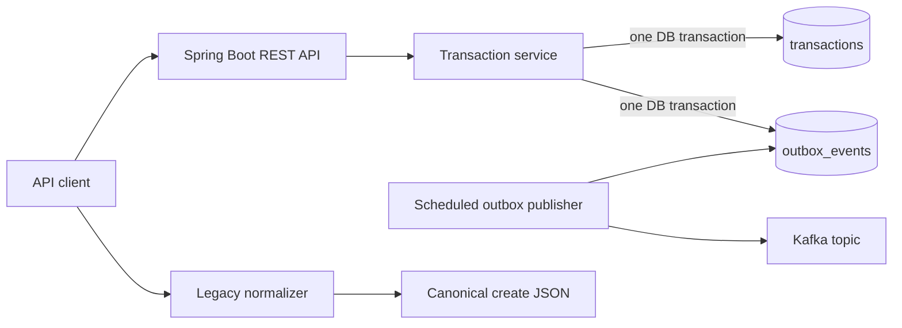

# Architecture

## Components

The application is grouped by feature:

- `transaction` owns the create endpoint, transaction model, persistence, and
  transaction-created event.
- `normalization` owns the legacy input format and conversion logic.
- `outbox` owns durable event storage and Kafka publication.
- `api` owns shared HTTP error responses.

## Consistency

The transaction record and outbox event are committed together. Therefore a
successful HTTP create cannot leave a transaction without a durable event
intent. The scheduled publisher locks a small batch of ready rows, sends each
payload to Kafka, and marks acknowledged rows as `PUBLISHED`.

If Kafka is unavailable, the row stays `PENDING`, records the error, and becomes
eligible after a short backoff. A crash after Kafka accepts an event but before
the database commits can produce a duplicate; this is normal at-least-once
delivery behavior.

## Deliberate limits

This is a single-service take-home implementation. It does not include API
version compatibility, historical migration repair, authentication, consumer
code, schema registry integration, outbox archival, or distributed operational
control planes.
