# Sequence-diagram catalog

These diagrams describe observable ordering and state transitions. Sections
labelled **implemented** correspond to executable repository behavior. Sections
labelled **planned** are next-phase designs and are not available today.

The use-case IDs and actor definitions are maintained in
[the use-case model](use-cases.md).

## Implemented runtime sequences

### UC-01 — Create and atomically stage an event

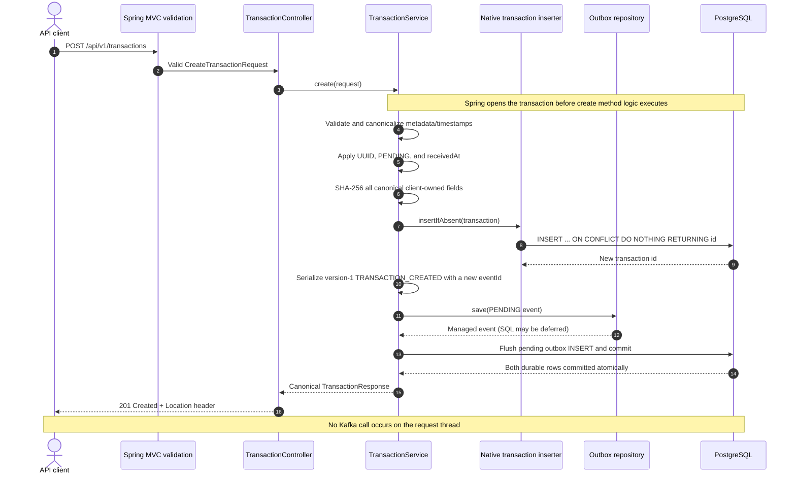

### UC-01 — Reject an invalid or duplicate create

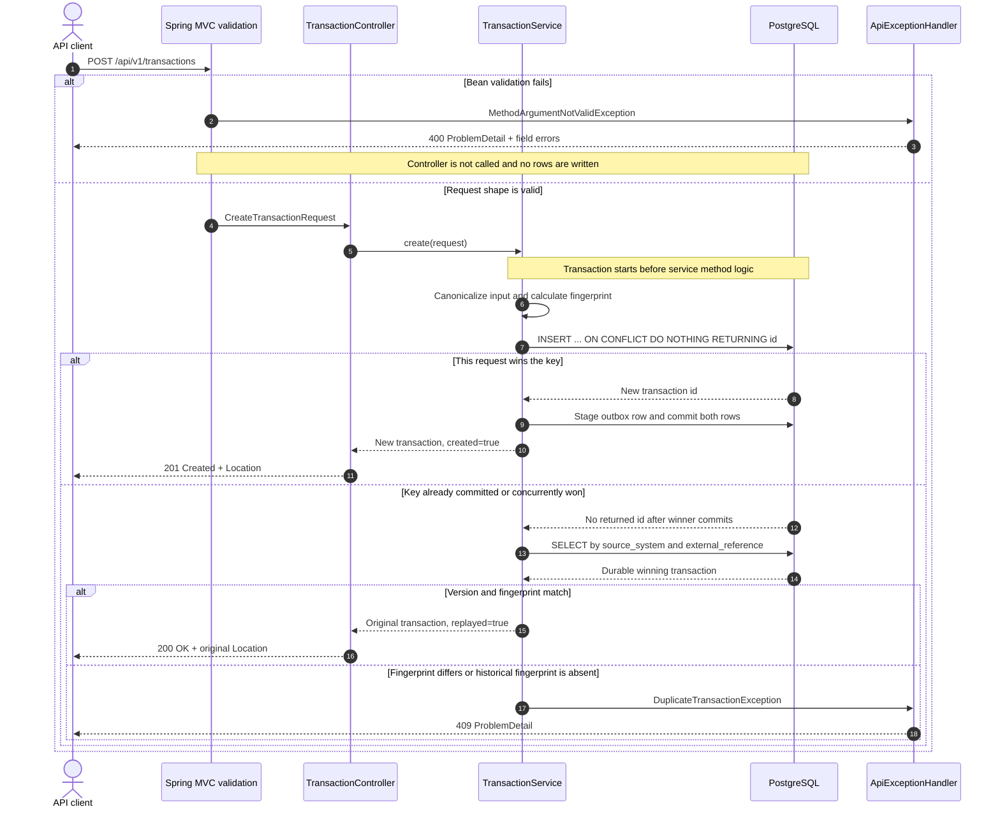

### UC-02 — Retrieve a transaction

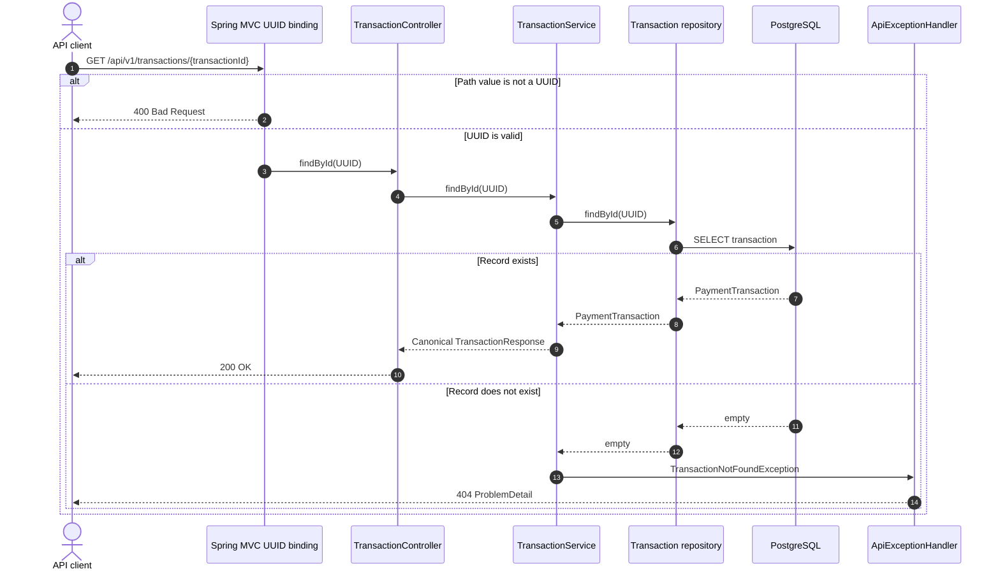

### UC-03 — Normalize a legacy transaction

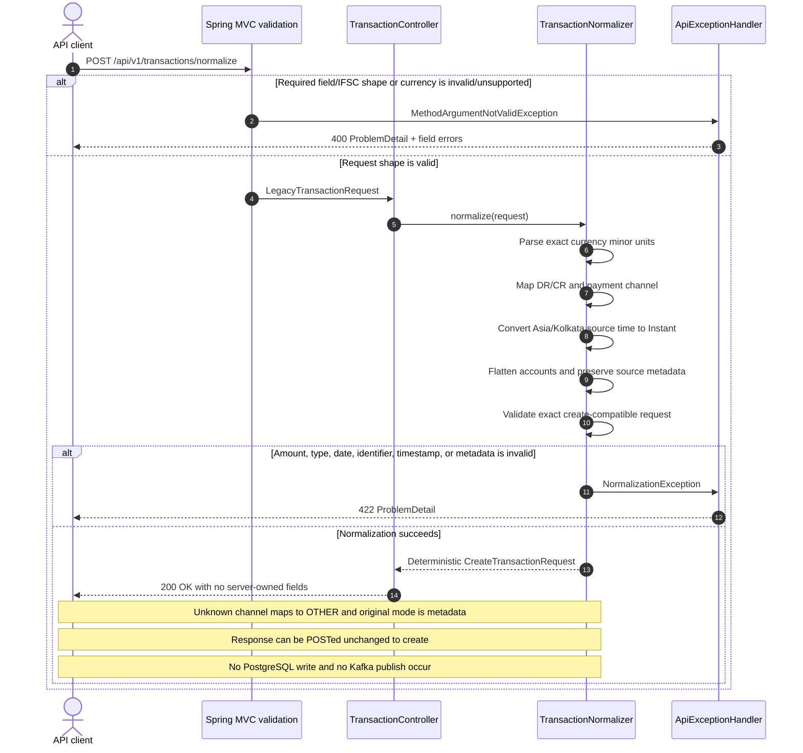

### UC-04, UC-05, UC-06 — Deliver, retry, or recover an outbox event

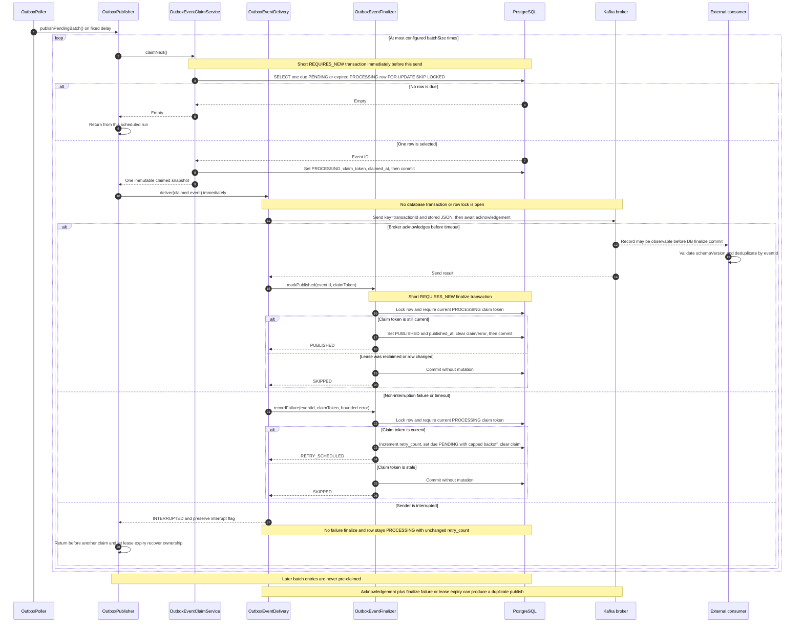

### UC-04 — Claim disjoint work across concurrent pollers

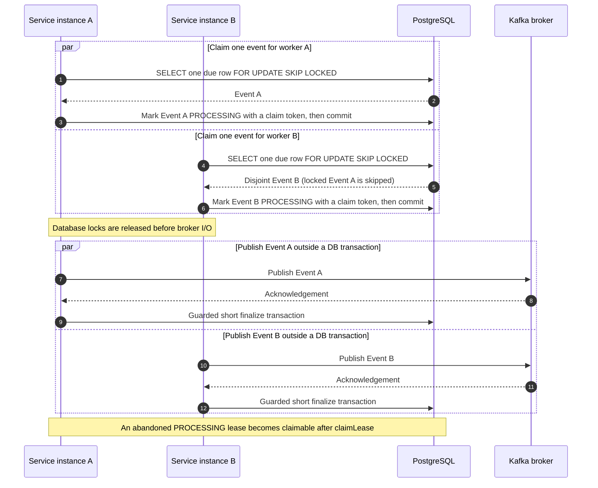

### UC-07 — Report application and delivery status

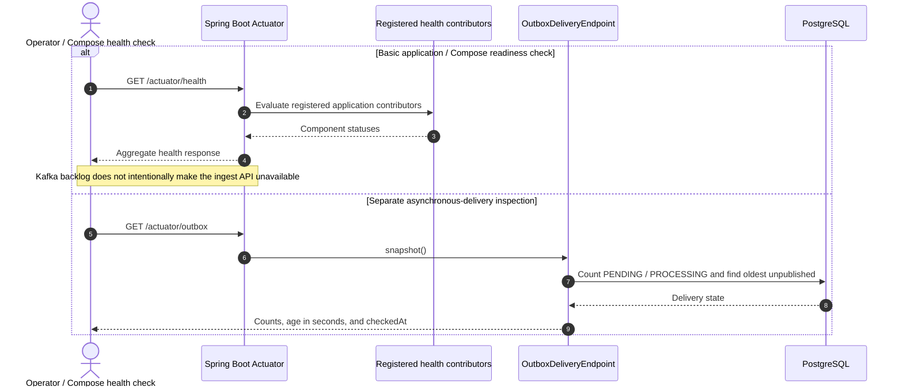

### UC-08 — Inspect retained outbox operational history

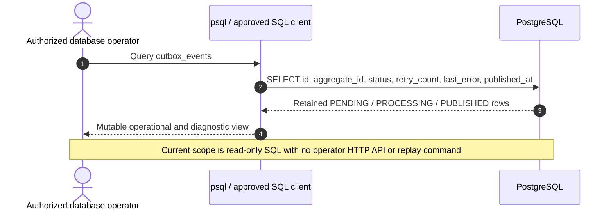

## Implemented engineering sequences

### ENG-01, ENG-02 — Build and run the local stack

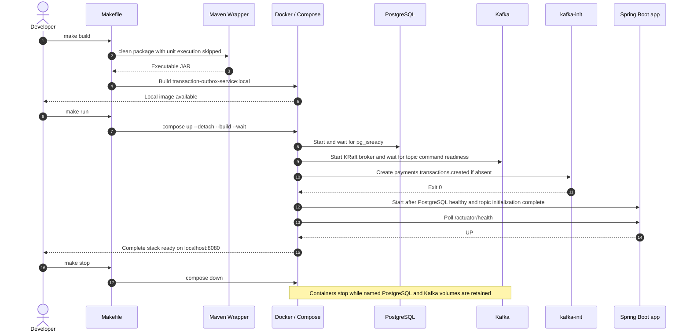

### ENG-03, ENG-06 — Execute local and CI quality gates

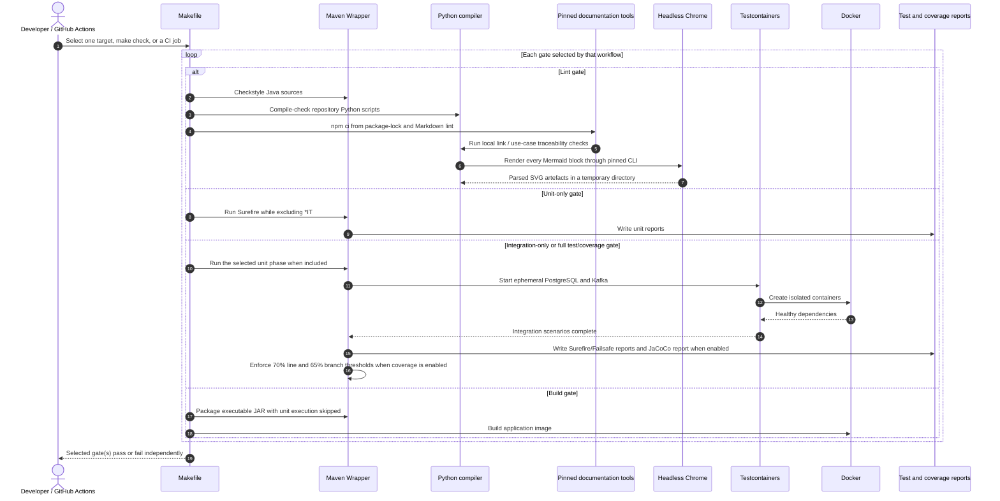

### ENG-04, ENG-05 — Verify mixed smoke and concurrent load traffic

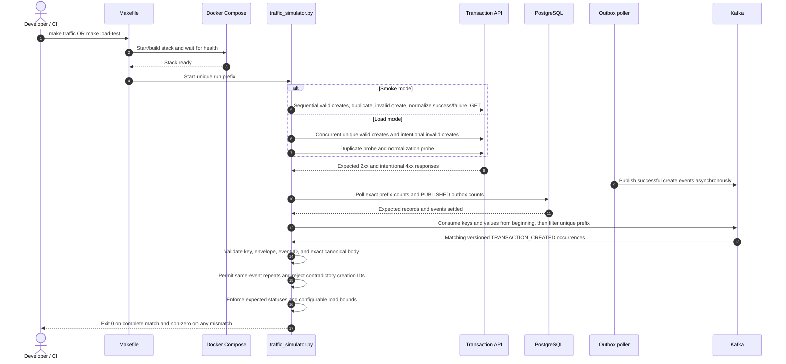

## Planned next-phase sequences

### UC-P01, UC-P02, UC-P03 — Planned secured request path

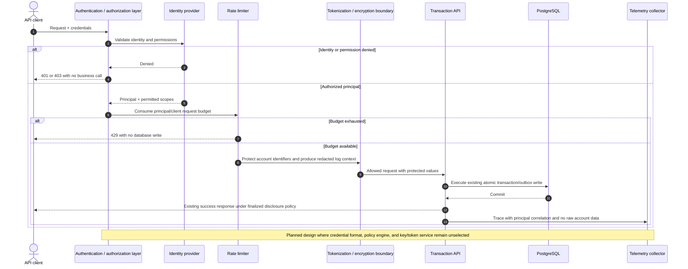

### UC-P04 — Planned operator expedite of a persistent retry

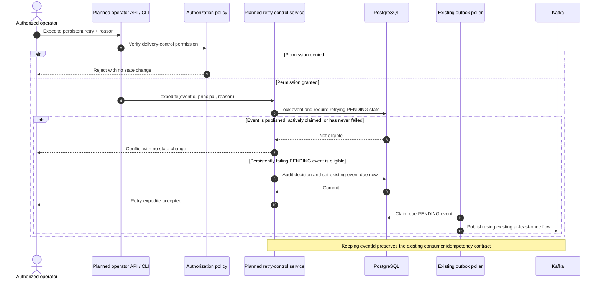

### UC-P05 — Planned archival of old PUBLISHED events

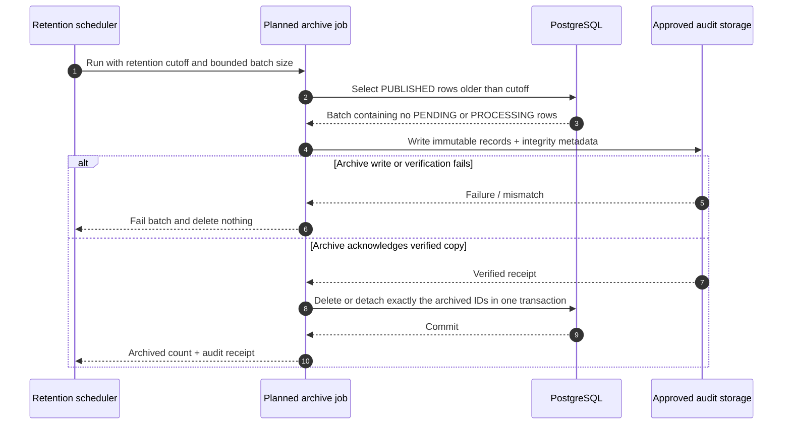

### UC-P06 — Planned telemetry and SLO alerting

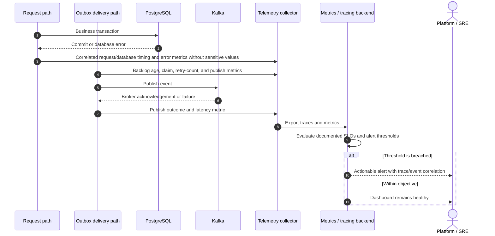

### UC-P07 — Planned schema-compatibility gate

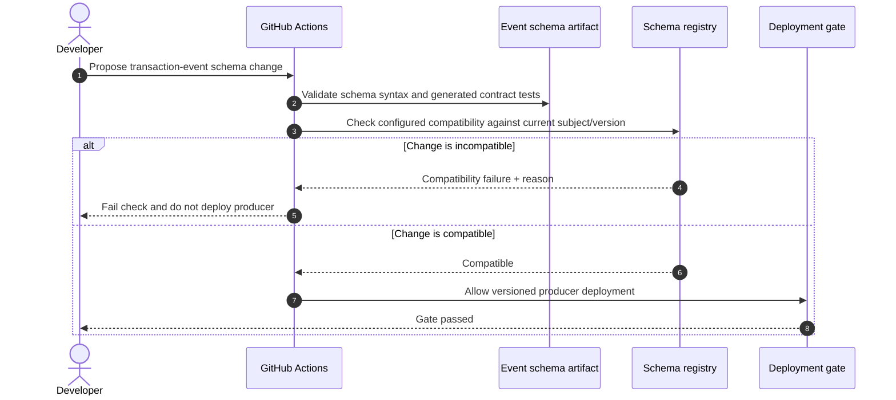
