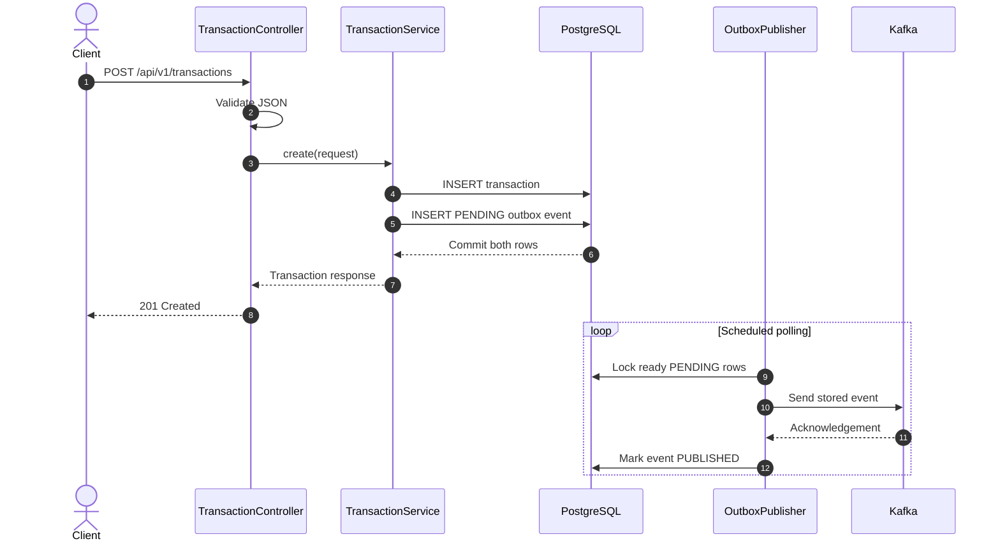
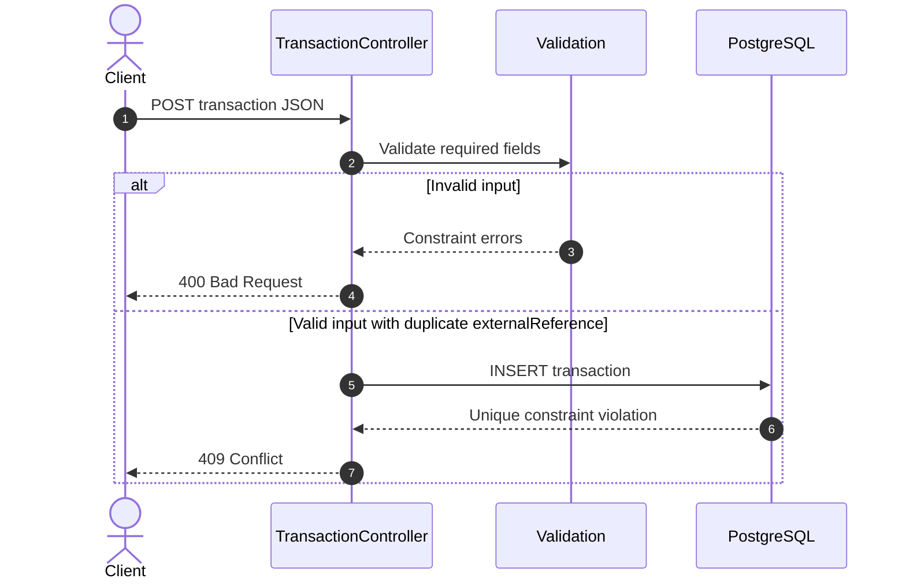
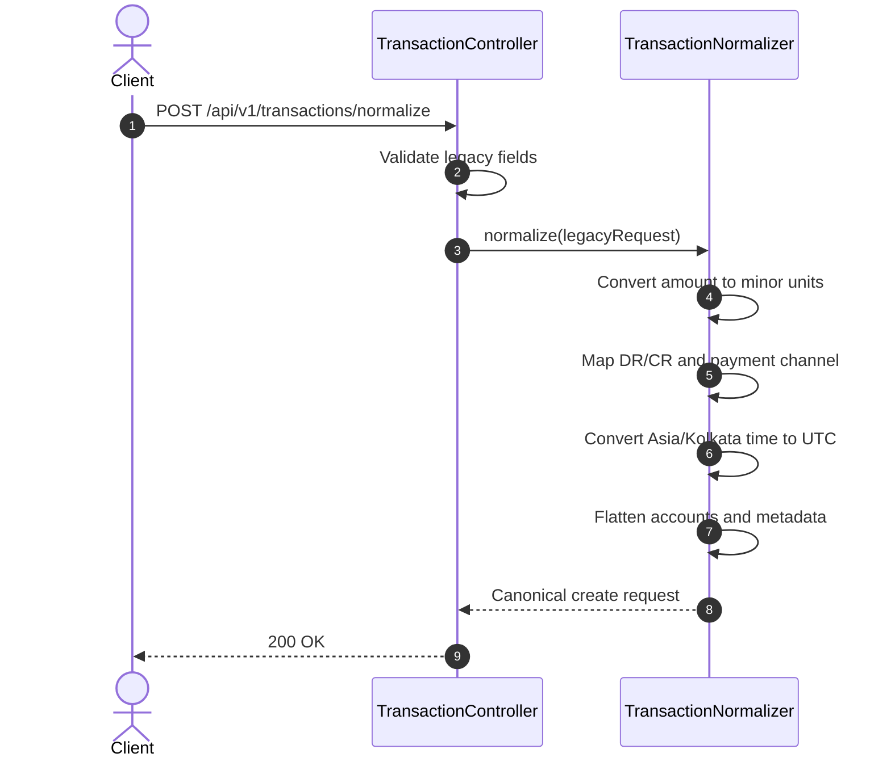
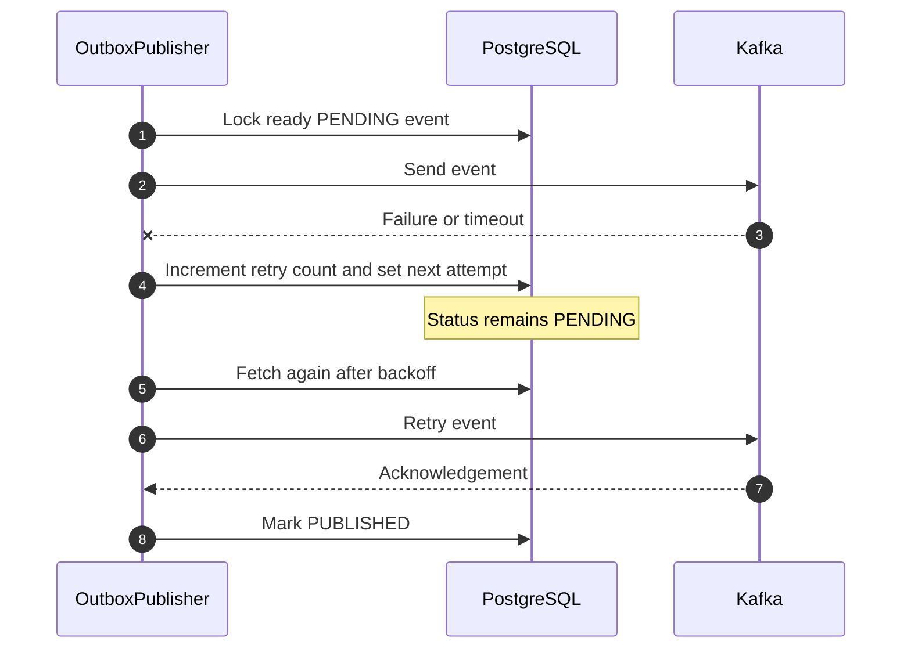

# Sequence diagrams

## Create and publish a transaction

The database commit happens before asynchronous Kafka delivery. This keeps the
request independent of temporary Kafka outages while preserving event intent.

## Reject invalid or duplicate input

Neither failure creates a committed outbox event.

## Normalize legacy JSON

The client may send the returned JSON unchanged to the create endpoint.
Normalization has no database or Kafka side effects.

## Retry a Kafka failure

