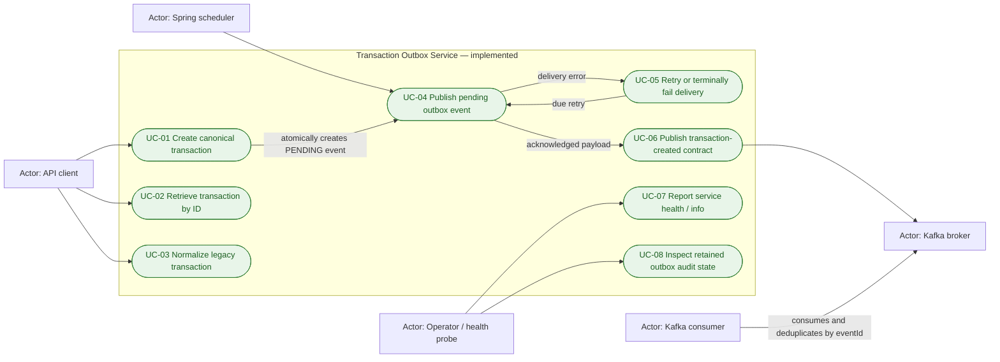
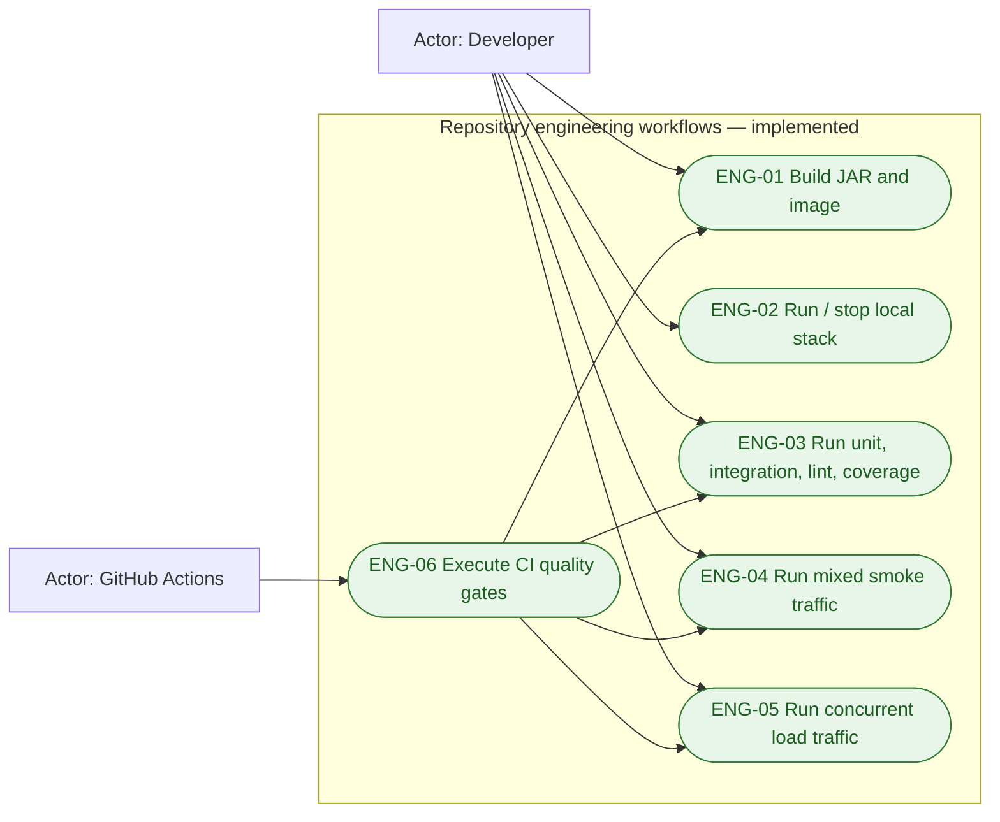
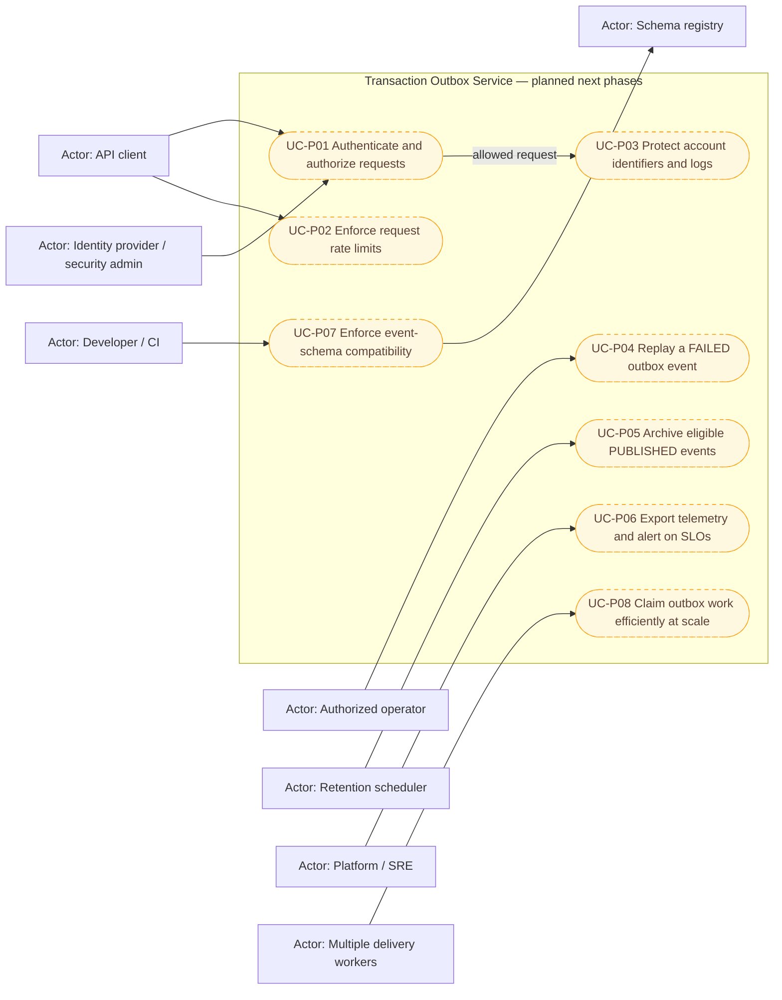

# Use-case model

This document is the scope inventory for the transaction outbox service. It
separates behavior that exists today from behavior proposed for later phases.
An item marked **planned** has no production implementation yet.

## Status vocabulary

| Status | Meaning |
|---|---|
| Implemented | Executable code exists in this repository |
| Implemented contract | The service side exists; another system owns the complementary behavior |
| Planned | A documented next-phase capability, not an available endpoint or job |

## Implemented product and operational use cases

| ID | Status | Primary actor and trigger | Successful outcome | Alternate or failure outcome |
|---|---|---|---|---|
| UC-01 | Implemented | API client sends `POST /api/v1/transactions` | Returns `201` with a canonical transaction and `Location`; transaction and `PENDING` outbox row commit atomically | Bean validation returns `400`; duplicate external reference or identifier returns `409`; serialization/database failure rolls back both writes |
| UC-02 | Implemented | API client sends `GET /api/v1/transactions/{transactionId}` | Returns `200` with the stored canonical transaction | Unknown UUID returns `404`; a malformed UUID is rejected by Spring request binding with `400` |
| UC-03 | Implemented | API client sends `POST /api/v1/transactions/normalize` with the legacy schema | Returns `200` with a canonical, non-persisted record; amount, type, timestamp, accounts, channel, and metadata are normalized | Shape validation returns `400`; unsupported currency/type, invalid amount precision, or invalid date returns `422`; no database or Kafka side effect occurs |
| UC-04 | Implemented | Scheduled poller finds a due `PENDING` outbox ID | Locks the row, publishes its stored payload, waits for Kafka acknowledgement, and commits status `PUBLISHED` | Missing, non-pending, or not-yet-due rows are skipped; concurrent workers serialize on the row lock |
| UC-05 | Implemented | Kafka send throws, times out, or is interrupted | Increments `retry_count`, stores a bounded root error, and schedules exponential backoff from 1 second up to 5 minutes | Once the configured maximum is reached, status becomes `FAILED`; there is currently no automatic or operator replay path |
| UC-06 | Implemented contract | UC-04 sends `TRANSACTION_CREATED` to `payments.transactions.created` | Kafka receives the transaction ID as key and the persisted event JSON as value | Delivery is at least once; external consumers, not this service, must deduplicate on `eventId` |
| UC-07 | Implemented | Operator or Compose health probe calls `/actuator/health` or `/actuator/info` | Actuator reports the registered application health/info state | A non-healthy result prevents Compose `--wait` from declaring the application ready |
| UC-08 | Implemented | Authorized operator queries PostgreSQL directly | Retained outbox rows expose status, retry count, error, and publication time for audit/diagnosis | No supported HTTP operator API, archival job, or replay command exists yet |

## Implemented engineering use cases

These workflows verify the packaged system but are not public payment APIs.

| ID | Interface | Verified outcome |
|---|---|---|
| ENG-01 | `make build` | Executable Spring Boot JAR and local container image build successfully |
| ENG-02 | `make run`, `make stop` | Application, PostgreSQL, Kafka, and topic initialization start in dependency order and stop while retaining the database volume |
| ENG-03 | `make unit-test`, `make integration-test`, `make test`, `make lint`, `make coverage`, `make check` | Unit and Testcontainers suites, Checkstyle, Python compilation, JaCoCo threshold, and toolchain enforcement pass |
| ENG-04 | `make traffic` | Expected `2xx`, `400`, `409`, and `422` responses occur and every successful create is correlated through PostgreSQL, `PUBLISHED` outbox state, and Kafka |
| ENG-05 | `make load-test` | Configurable concurrent valid/invalid traffic completes with the expected status distribution and full pipeline correlation; throughput and p50/p95/p99 latency are reported |
| ENG-06 | `.github/workflows/ci.yml` | Independent lint, unit, integration, coverage, build, and bounded end-to-end/load checks are defined for pushes and pull requests targeting `main` |

## Planned next-phase use cases

The following diagram is a roadmap, not a representation of current runtime
behavior. Endpoint names, storage choices, and authorization policy must be
finalized during the relevant phase.

| ID | Status | Intended actor and trigger | Required outcome before the use case is considered complete |
|---|---|---|---|
| UC-P01 | Planned | API client presents credentials; security policy is administered externally | Reject unauthenticated/unauthorized calls and attach an auditable principal to allowed operations |
| UC-P02 | Planned | API client exceeds a configured request budget | Enforce documented per-principal/client limits and return a deterministic throttling response without partial writes |
| UC-P03 | Planned | An allowed request contains account identifiers | Tokenize or encrypt stored identifiers, redact logs/errors, and define controlled detokenization access where required |
| UC-P04 | Planned | Authorized operator selects a `FAILED` event | Requeue safely without changing the business transaction, preserve `eventId` idempotency semantics, and record who replayed what and why |
| UC-P05 | Planned | Retention scheduler finds old `PUBLISHED` events past policy | Copy to approved audit storage, verify the archive, then remove/partition source rows without touching `PENDING` or `FAILED` events |
| UC-P06 | Planned | Request/outbox activity or an SLO breach occurs | Export correlated traces and broker/database/outbox metrics; provide dashboards and actionable alerts |
| UC-P07 | Planned | CI proposes an event-schema change | Check the chosen compatibility mode against the registry and block incompatible deployment before producers emit the change |
| UC-P08 | Planned | Multiple instances process a high-volume backlog | Atomically claim disjoint batches, for example with claim tokens or `FOR UPDATE SKIP LOCKED`, while retaining at-least-once delivery |

## Traceability to sequence diagrams

Every use case above is represented in
[the sequence-diagram catalog](sequence-diagrams.md):

| Use cases | Sequence-diagram section |
|---|---|
| UC-01 | Create and atomically stage an event; reject invalid or duplicate create |
| UC-02 | Retrieve a transaction |
| UC-03 | Normalize a legacy transaction |
| UC-04, UC-05, UC-06 | Deliver, retry, or fail an outbox event; serialize concurrent delivery |
| UC-07, UC-08 | Report health; inspect retained audit state |
| ENG-01, ENG-02 | Build and run the local stack |
| ENG-03, ENG-06 | Execute local and CI quality gates |
| ENG-04, ENG-05 | Verify smoke and concurrent load traffic |
| UC-P01, UC-P02, UC-P03 | Planned secured request path |
| UC-P04 | Planned operator replay |
| UC-P05 | Planned archival workflow |
| UC-P06 | Planned telemetry and SLO alerting |
| UC-P07 | Planned schema-compatibility gate |
| UC-P08 | Planned scalable outbox claiming |
