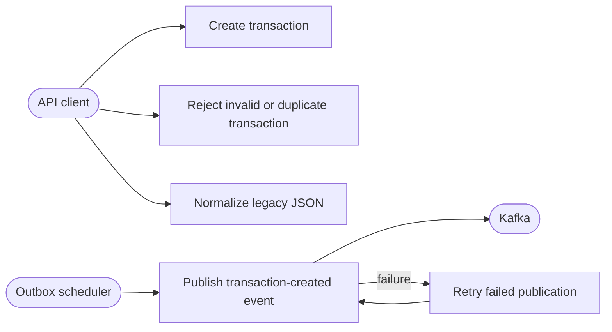

# Use cases

| ID | Implemented use case | Result |
| --- | --- | --- |
| UC-01 | Create a valid transaction | PostgreSQL transaction and outbox rows are committed; HTTP 201 |
| UC-02 | Reject an invalid transaction | HTTP 400; no durable rows |
| UC-03 | Reject a duplicate reference | HTTP 409; original row remains |
| UC-04 | Normalize legacy JSON | Canonical create-request JSON; no side effects |
| UC-05 | Publish an outbox event | Kafka acknowledgement followed by `PUBLISHED` |
| UC-06 | Retry Kafka failure | Row remains `PENDING` with retry information |

Only implemented behavior is documented. Authorization, settlement, ledgering,
reconciliation, administration, and archival are outside this service.
