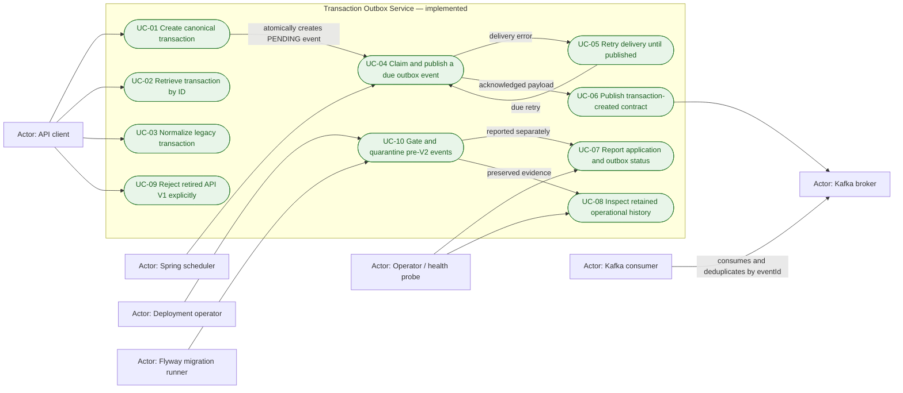
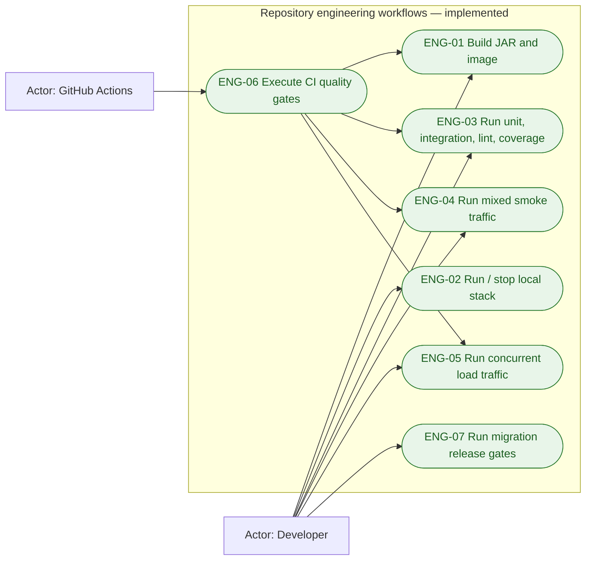
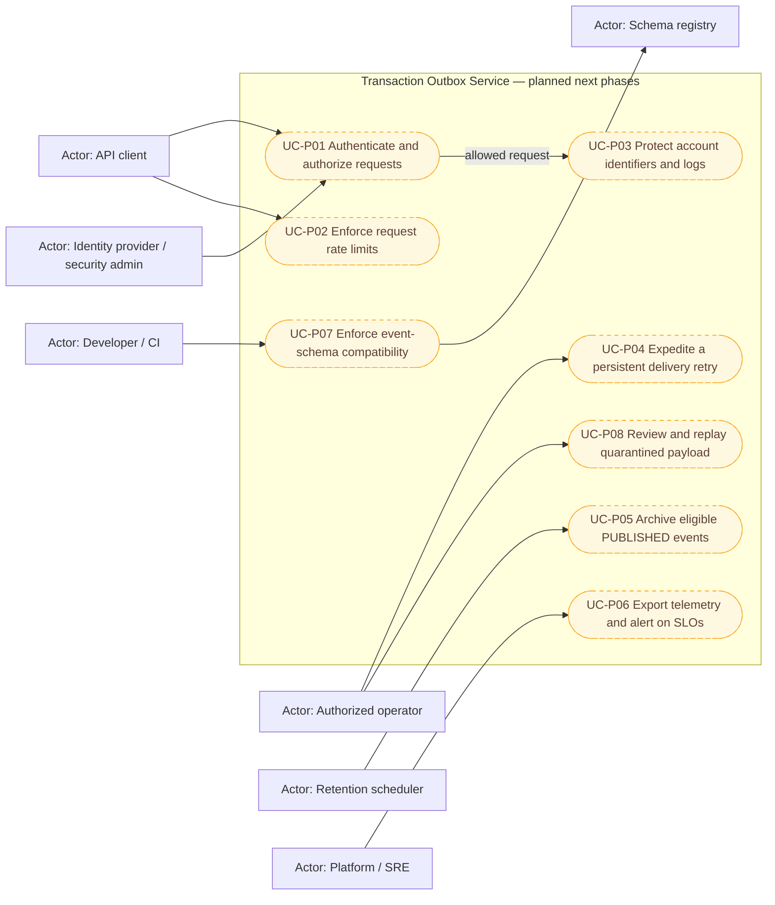

# Use-case model

This document is the scope inventory for the transaction outbox service. It
separates behavior that exists today from behavior proposed for later phases.
An item marked **planned** has no production implementation yet.

## Status vocabulary

| Status | Meaning |
|---|---|
| Implemented | Executable code exists in this repository |
| Implemented contract | The service side exists; another system owns the complementary behavior |
| Planned | A documented next-phase capability, not an available endpoint or job |

## Implemented product and operational use cases

| ID | Status | Primary actor and trigger | Successful outcome | Alternate or failure outcome |
|---|---|---|---|---|
| UC-01 | Implemented | API client sends strict `POST /api/v2/transactions` JSON | A database-native decision on `(sourceSystem, externalReference)` gives one concurrent winner: new input returns `201` and atomically commits a canonical transaction plus `PENDING` event; a matching durable-fingerprint replay returns the original record with `200` | Invalid/coerced/oversized input returns `400`; a differing or unverifiable historical fingerprint returns `409`; serialization/database failure rolls back the create |
| UC-02 | Implemented | API client sends `GET /api/v2/transactions/{transactionId}` | Returns `200` with the stored canonical transaction | Unknown UUID returns `404`; a malformed UUID is rejected by Spring request binding with `400` |
| UC-03 | Implemented | API client sends `POST /api/v2/transactions/normalize` with the legacy schema | Returns `200` with deterministic, create-compatible JSON and no server-owned fields; that body can be submitted unchanged to UC-01 | Legacy shape validation returns `400`; unsupported type, inexact/invalid amount, invalid date, or non-canonical output returns `422`; normalization itself has no database or Kafka side effect |
| UC-04 | Implemented | Scheduled poller claims a due `PENDING` or expired `PROCESSING` row immediately before each send | A short `SKIP LOCKED` transaction commits one claim token; Kafka I/O runs without a DB transaction; a guarded short transaction records `PUBLISHED` | Concurrent workers receive disjoint claims; later batch entries are never pre-claimed; abandoned leases become claimable; a stale worker cannot finalize a newer claim |
| UC-05 | Implemented | Kafka send throws, times out, or is interrupted | An ordinary V2 failure increments `retry_count`, stores a bounded root error, releases the claim, and schedules indefinite exponential backoff capped at five minutes | Interruption preserves the interrupt, consumes no retry, leaves `PROCESSING` ownership for lease recovery, and stops the batch |
| UC-06 | Implemented contract | UC-04 sends `TRANSACTION_CREATED` to `payments.transactions.created` | Kafka receives transaction ID as key and a schema-version-2 envelope with producer, event identity/time, and canonical V2 body | Delivery is at least once; external consumers, not this service, must validate the version and deduplicate on `eventId`; already-published V1 events may remain on the topic |
| UC-07 | Implemented | Probe calls `/actuator/health` or operator calls `/actuator/outbox` | Basic application health remains independent; one point-in-time aggregate reports pending, processing, and quarantined counts; publishable age uses event creation and quarantine age uses quarantine time | Compose readiness can be `UP` during broker backlog or quarantine by design; alert routing and thresholds remain planned |
| UC-08 | Implemented | Local database operator queries PostgreSQL directly | Retained mutable rows expose publishable, published, and quarantined status plus retry/error/claim/quarantine evidence for diagnosis | This is operational history, not tamper-evident audit storage; no operator mutation API, quarantine-release workflow, or archival job exists |
| UC-09 | Implemented | Client calls a retired V1 create, normalize, or GET-by-ID route | Returns `410 Gone`, a stable problem type, and the exact V2 collection, normalize, or same-ID successor without binding the old request | No transaction/outbox row is created and V1 is never silently interpreted as V2 |
| UC-10 | Implemented | Deployment operator stops writers, snapshots the database, and runs the read-only V7 preflight before Flyway | A zero historical-unpublished count permits the byte-compatible V6-to-V7 upgrade; V7 installs quarantine evidence/constraints/index without rewriting V1-V6 | A nonzero count must be drained by the compatible publisher or release remains blocked; V7 can quarantine remaining post-V6 `PENDING`/`PROCESSING` rows as containment, but that does not complete historical delivery and UC-P08 is still required |

## Implemented engineering use cases

These workflows verify the packaged system but are not public payment APIs.

| ID | Interface | Verified outcome |
|---|---|---|
| ENG-01 | `make build` | Executable Spring Boot JAR and local container image build successfully |
| ENG-02 | `make run`, `make stop`, `make reset` | Stack starts in dependency order; ordinary stop retains both PostgreSQL and Kafka volumes; explicit reset deletes both |
| ENG-03 | `make unit-test`, `make integration-test`, `make test`, `make lint`, `make docs-lint`, `make coverage`, `make check` | Tests, Checkstyle, Python compilation, pinned Markdown/Mermaid/link checks, JaCoCo threshold, and toolchain enforcement pass |
| ENG-04 | `make traffic` | Expected `2xx`, `400`, `409`, `410`, and `422` responses occur; retired V1 creates no state; exact HTTP/DB/outbox/Kafka contracts correlate for every successful V2 create |
| ENG-05 | `make load-test` | Concurrent valid/invalid traffic satisfies configurable throughput and p95 bounds, expected statuses, and exact pipeline checks; the result is local acceptance evidence, not capacity |
| ENG-06 | `.github/workflows/ci.yml` | SHA-pinned static/docs, test/coverage, build, and E2E/load gates run for `main` PRs and `main`/`tgusain/**` pushes; dependency review additionally gates PRs |
| ENG-07 | `make migration-preflight`, `make migration-v7-preflight` | Read-only repeatable-read reports expose identity/currency collisions and historical unpublished events; operators retain the worklists and enforce their documented zero-count gates before release |

## Planned next-phase use cases

The following diagram is a roadmap, not a representation of current runtime
behavior. Endpoint names, storage choices, and authorization policy must be
finalized during the relevant phase.

| ID | Status | Intended actor and trigger | Required outcome before the use case is considered complete |
|---|---|---|---|
| UC-P01 | Planned | API client presents credentials; security policy is administered externally | Reject unauthenticated/unauthorized calls and attach an auditable principal to allowed operations |
| UC-P02 | Planned | API client exceeds a configured request budget | Enforce documented per-principal/client limits and return a deterministic throttling response without partial writes |
| UC-P03 | Planned | An allowed request contains account identifiers | Tokenize or encrypt stored identifiers, redact logs/errors, and define controlled detokenization access where required |
| UC-P04 | Planned | Authorized operator selects a persistently failing `PENDING` event after resolving the dependency | Make the existing event due immediately without changing the business transaction or `eventId`, and audit who expedited it and why |
| UC-P05 | Planned | Retention scheduler finds old `PUBLISHED` events past policy | Copy to approved audit storage, verify the archive, then remove/partition source rows without touching `PENDING` or `PROCESSING` events |
| UC-P06 | Planned | Request/outbox activity or an SLO breach occurs | Export correlated traces and broker/database/outbox metrics; provide dashboards and actionable alerts |
| UC-P07 | Planned | CI proposes an event-schema change | Check the chosen compatibility mode against the registry and block incompatible deployment before producers emit the change |
| UC-P08 | Planned | Authorized operator selects a `QUARANTINED` legacy event after compatibility analysis | Preserve the original, audit actor/reason/decision, explicitly validate or transform to V2, and create a causally linked replacement only under a reviewed event-ID/deduplication policy |

## Traceability to sequence diagrams

Every use case above is represented in
[the sequence-diagram catalog](sequence-diagrams.md):

| Use cases | Sequence-diagram section |
|---|---|
| UC-01 | Create and atomically stage an event; reject invalid or duplicate create |
| UC-02 | Retrieve a transaction |
| UC-03 | Normalize a legacy transaction |
| UC-04, UC-05, UC-06 | Claim, deliver, or recover an outbox event; claim disjoint concurrent work |
| UC-07, UC-08 | Report application/delivery/quarantine status; inspect retained operational history |
| UC-09 | Reject retired API V1 explicitly |
| UC-10, ENG-07 | Gate and quarantine pre-V2 unpublished events |
| ENG-01, ENG-02 | Build and run the local stack |
| ENG-03, ENG-06 | Execute local and CI quality gates |
| ENG-04, ENG-05 | Verify smoke and concurrent load traffic |
| UC-P01, UC-P02, UC-P03 | Planned secured request path |
| UC-P04 | Planned operator retry expedite |
| UC-P05 | Planned archival workflow |
| UC-P06 | Planned telemetry and SLO alerting |
| UC-P07 | Planned schema-compatibility gate |
| UC-P08 | Planned quarantined-payload compatibility review |
